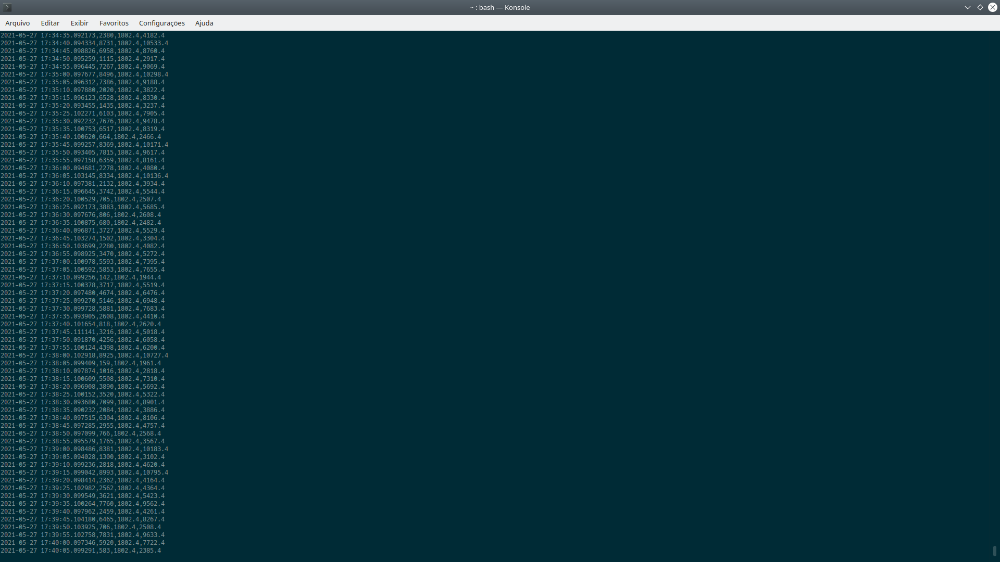

<h1 align="center"> mobilityhouse </h1>





<h1 align="center"> What is it?</h1>
This programs are part of the mobilityhouse PV Simulator Challenge.

* **meter_sender.py** is a client program which produces a random value between 0 and 9000 simulating energy consumption, it send to RabbitMq broker

* **magic_table.csv** PV_simulator.py need to load a certain profile of energy production(PV). The solution I found was to download the data from https://data.open-power-system-data.org/time_series/, pick only the german production during summer and map the numbers with the test draw. The result is very close to real, but we have only data every 15 min. For a better view maybe next step is to distribute this data throut this 15 min.l

* **PV_simulator.py** is a program which load data from the broker and print a graphic. The program also looks in magic_table for the PV production during the day.
It output a file named "Data_recorded.csv" which has a timestamp ,meter data, PV simulator, meter data + PV simulator.

<h1 align="center"> What I need?</h1>

*  PYQTGRAPH   http://www.pyqtgraph.org/
```python3 
pip3 install pyqtgraph
```

*  RabbitMQ   https://www.rabbitmq.com/install-debian.html#installation-methods
```bash
#!/bin/sh

sudo apt-get install curl gnupg debian-keyring debian-archive-keyring apt-transport-https -y

## Team RabbitMQ's main signing key
sudo apt-key adv --keyserver "hkps://keys.openpgp.org" --recv-keys "0x0A9AF2115F4687BD29803A206B73A36E6026DFCA"
## Launchpad PPA that provides modern Erlang releases
sudo apt-key adv --keyserver "keyserver.ubuntu.com" --recv-keys "F77F1EDA57EBB1CC"
## PackageCloud RabbitMQ repository
curl -1sLf 'https://packagecloud.io/rabbitmq/rabbitmq-server/gpgkey' | sudo apt-key add -

## Add apt repositories maintained by Team RabbitMQ
sudo tee /etc/apt/sources.list.d/rabbitmq.list <<EOF
## Provides modern Erlang/OTP releases
##
## "bionic" as distribution name should work for any reasonably recent Ubuntu or Debian release.
## See the release to distribution mapping table in RabbitMQ doc guides to learn more.
deb http://ppa.launchpad.net/rabbitmq/rabbitmq-erlang/ubuntu bionic main
deb-src http://ppa.launchpad.net/rabbitmq/rabbitmq-erlang/ubuntu bionic main

## Provides RabbitMQ
##
## "bionic" as distribution name should work for any reasonably recent Ubuntu or Debian release.
## See the release to distribution mapping table in RabbitMQ doc guides to learn more.
deb https://packagecloud.io/rabbitmq/rabbitmq-server/ubuntu/ bionic main
deb-src https://packagecloud.io/rabbitmq/rabbitmq-server/ubuntu/ bionic main
EOF

## Update package indices
sudo apt-get update -y

## Install Erlang packages
sudo apt-get install -y erlang-base \
                        erlang-asn1 erlang-crypto erlang-eldap erlang-ftp erlang-inets \
                        erlang-mnesia erlang-os-mon erlang-parsetools erlang-public-key \
                        erlang-runtime-tools erlang-snmp erlang-ssl \
                        erlang-syntax-tools erlang-tftp erlang-tools erlang-xmerl

## Install rabbitmq-server and its dependencies
sudo apt-get install rabbitmq-server -y --fix-missing
 
 ```
 
 <h1 align="center"> How to run</h1>
 
 **Start the client**
 ```bash
 python3 meter_sender.py
 ```
 
 **Start the VP simulator**
 ```bash
 python3 VP_simulator.py
 ```
